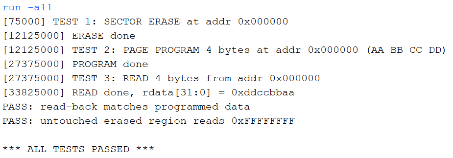

# Memory Subsystem — SPI Flash Controller + Cached AXI4 Memory Path

Two independent, verified building blocks of a hardware memory subsystem, written in SystemVerilog:

1. **SPI NOR Flash Controller** — a driver stack for interfacing with a real SPI flash chip (read / program / erase / status polling).
2. **N-way Set-Associative Cache + AXI4 Master** — a cached memory access path modeling the CPU-to-DRAM side of an SoC.

---

## Repo structure

```
axi-memsys/
├── rtl/
│   ├── spi/            spi_master.sv, spi_flash_ctrl.sv
│   ├── axi/             axi4_master.sv
│   └── cache/           cache_nway.sv
├── sim/
│   └── spi/             flash_model_bfm.sv, tb_flash_control.sv
└── README.md
```
---

## Part 1 — SPI Flash Controller

### Overview

A two-layer driver stack that lets simple requests perform real flash operations like Read, Page Program and Sector Erase through a physical 4-wire SPI bus.

```
Caller (testbench)
        │  cmd, addr, len, wdata / rdata, start / busy / done
        ▼
┌─────────────────────┐
│  SPI Flash Controller │  ← knows opcodes, address framing, write-enable + status polling
└─────────────────────┘
        │  8-bit byte, start / busy / done
        ▼
┌─────────────────────┐
│     SPI Master        │  ← dumb byte shifter, Mode 0 (CPOL=0, CPHA=0)
└─────────────────────┘
        │  SCLK / MOSI / MISO / (CS owned by Flash Controller)
        ▼
   SPI NOR Flash chip
```

### Modules

| File | Description |
|---|---|
| `rtl/spi-flash/spi_master.sv` | Byte-level SPI Mode 0 master. Configurable clock divider (`SPIFREQ`/`CLKFREQ` parameters), parameterized word width `N`. Acts like a pure shift-register engine. |
| `rtl/spi-flash/spi_flash_control.sv` | Command sequencer on top of the SPI Master. Implements Read, Page Program, and Sector Erase, including the mandatory Write-Enable (`0x06`) prefix and Read-Status-Register (`0x05`) busy-polling loop required before/after any write or erase. |
| `sim/spi-flash/flash_model.sv` | Behavioral flash-chip model for simulation (not synthesizable) — stands in for a real W25Q-style chip, responding to opcodes with a backing byte array. |
| `sim/tb_flash.sv` | Self-checking testbench: erase → program → read-back → verify, plus a check that untouched erased memory reads `0xFF`. |

### Key design decisions

- **CS is owned by the Flash Controller, not the SPI Master** — the SPI Master has no concept of multi-byte transactions; only the layer that understands "opcode + address + data, all under one CS-low window" can correctly sequence CS.
- **`mosi` is a combinational tap on the shift register's MSB**, not a registered signal updated on a separate edge — this avoids a shift-before-drive race that corrupts the first transmitted bit.
- **5-phase FSM** (`WEN_PHASE` → `MAIN_PHASE` → `POLL_PHASE`) is reused across all three commands via a `phase` register, rather than duplicating states per command — Program and Erase both need Write-Enable and polling; Read needs neither and skips straight to `MAIN_PHASE`.
- **Byte-index-driven sequencing**: a single `byte_idx` counter walks through however many bytes a given phase needs (opcode, 3 address bytes, N data/dummy bytes), avoiding one dedicated state per byte.

### Verification

Simulated in Vivado. The self-checking testbench:

1. Erases a 1KB sector
2. Programs 4 bytes (`0xAA 0xBB 0xCC 0xDD`) at the sector start
3. Reads them back and checks an exact match
4. Confirms an untouched region within the erased sector reads `0xFF` (proving Erase actually happened, not just Program)

```
*** ALL TESTS PASSED ***
```

The Erase and Program operations both took several million ns of simulated time (vs. a handful of µs for a single command's raw byte count) — confirming the Write-Enable → Command → Poll(×N) sequencing genuinely executed, rather than the FSM falling through early.



---

## Part 2 — N-way Set-Associative Cache + AXI4 Master

